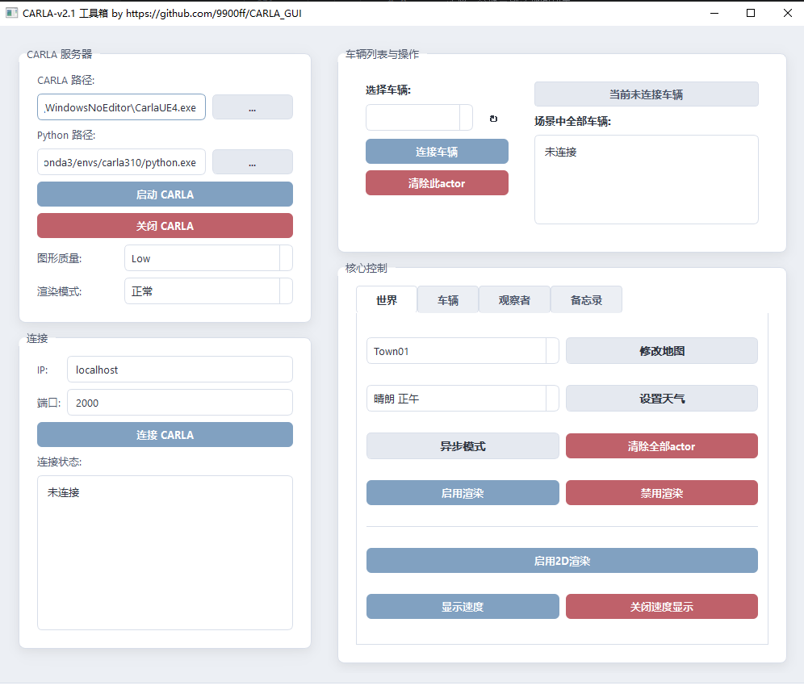
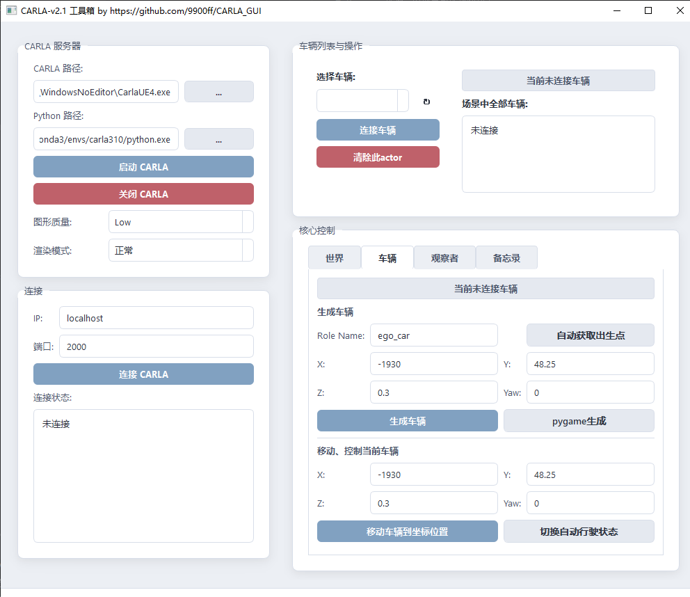
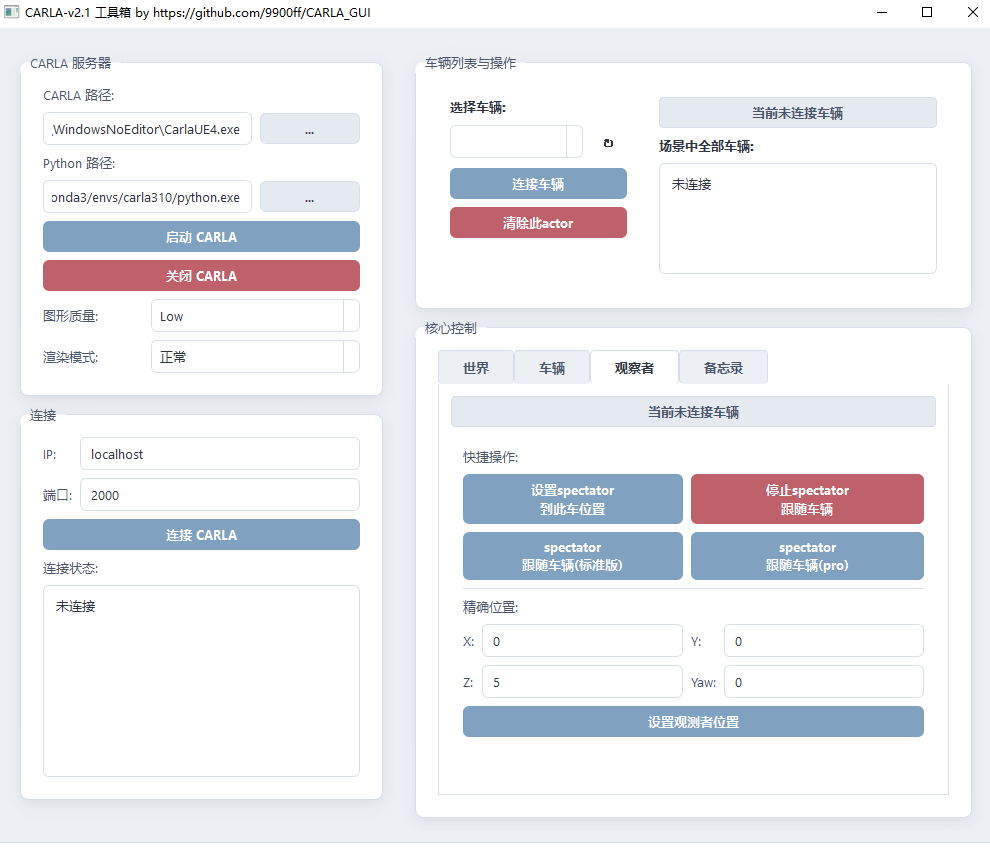

# CarlaGUI - CARLA 模拟器图形化控制工具

> **便捷、直观的 CARLA 自动驾驶仿真调试助手**


## 📖 项目简介

**CarlaGUI** 是一个基于 PyQt5 开发的图形用户界面工具，专为 [CARLA Simulator](https://carla.org/) 设计。

releases包已经内置运行环境。解压即用，无需配置环境

在进行自动驾驶算法研究时，频繁使用命令行启动服务器、编写脚本生成车辆或调整天气往往繁琐且重复。本工具旨在简化这些流程，提供一个可视化的控制面板，让研究人员和开发者能够**零代码**快速搭建仿真场景，专注于核心算法的开发。

b站视频介绍：https://www.bilibili.com/video/BV1mfv2BwETA/

## ✨ 主要功能

* **服务器管理**：一键启动/关闭 CARLA 服务器，支持自定义端口、画质等级及渲染模式（离屏/正常）。
* **连接与监控**：实时监控客户端连接状态、服务器版本、同步/异步模式状态。
* **车辆生成 (Spawn)**：
    * 支持手动输入坐标生成车辆。
    * **自动吸附功能**：根据当前观测者视角，自动寻找最近的道路生成车辆（防卡死）。
    * 支持自定义车辆角色名 (Role Name)。
* **车辆控制**：
    * 一键开启/切换 **Autopilot** 自动驾驶模式。
    * 支持将现有车辆“瞬移”到指定坐标。
    * 实时显示场景内所有车辆的速度信息 (Tag 标签)。
* **观测者 (Spectator) 工具**：
    * **上帝视角跟随**：支持两种跟随模式（Easy/Pro），带平滑运镜效果，自动锁定目标车辆。
    * 一键将观测者移动到指定坐标或车辆后方。
* **环境调节**：
    * 下拉菜单一键切换地图 (Town01 - Town10 等)。
    * 实时调整天气（晴天、雨天、日出、正午等预设）。
* **高级功能**：
    * **Pygame 窗口支持**：支持唤起独立的 Pygame 渲染窗口进行人工驾驶（需配置本地 Python 路径）。
    * **2D HUD**：支持启动无渲染模式下的 2D 信息面板。（需设置本地 Python 路径）。
    * **配置记忆**：自动保存上次的路径设置、生成坐标和备忘录信息至 `config.ini`。

<p align="center">
    
    
    
</p>

## 🛠️ 安装与运行

### 方式一：直接运行（推荐）
本项目已内置基础 Python 运行环境，下载 Release 包后直接运行 `start.bat`  即可。

仅仅pygame生成和2D渲染 需要设置本地python路径（很少用这两个功能）

### 方式二：源码运行
如果你需要进行二次开发建议配置完整的 Python 环境

1.  **克隆仓库**
    ```bash
    git clone https://github.com/9900ff/CARLA_GUI.git
    cd CarlaGUI/app
    ```

2.  **安装依赖**
    ```bash
    pip install -r requirements.txt
    ```

3.  **运行**
    ```bash
    python Carla_QtGUI.py
    ```

## ⚙️ 配置说明

首次运行时，请在界面中进行以下设置：

1.  **CARLA 路径**：点击“选择 CARLA”按钮，指向你的 `CarlaUE4.exe` 文件路径。
2.  **Python 路径**（重要）：
    * 本工具的基础功能（连接、生成、天气）使用内置环境即可。
    * **若要使用 Pygame 渲染窗口或 2D HUD 功能**，必须在界面中指定你本地安装了 `carla` 和 `pygame` 库的 `python.exe` 路径。

部分配置会自动保存到项目根目录的 `config.ini` 文件中。

## ⚠️ 注意事项与已知问题

* **Bug 提示**：本项目目前为个人开发版本，部分功能可能存在 Bug，欢迎提 Issue 反馈。
* **版本兼容**：建议使用 CARLA 0.9.15 版本，不同版本未测试
* **Pygame 路径**：如果点击“Pygame 生成车辆”无反应，请务必检查“Python 路径”设置是否正确，且该 Python 环境已安装 `pygame` 库。

## 📜 开源协议

本项目采用 [MIT License](LICENSE) 开源协议。
